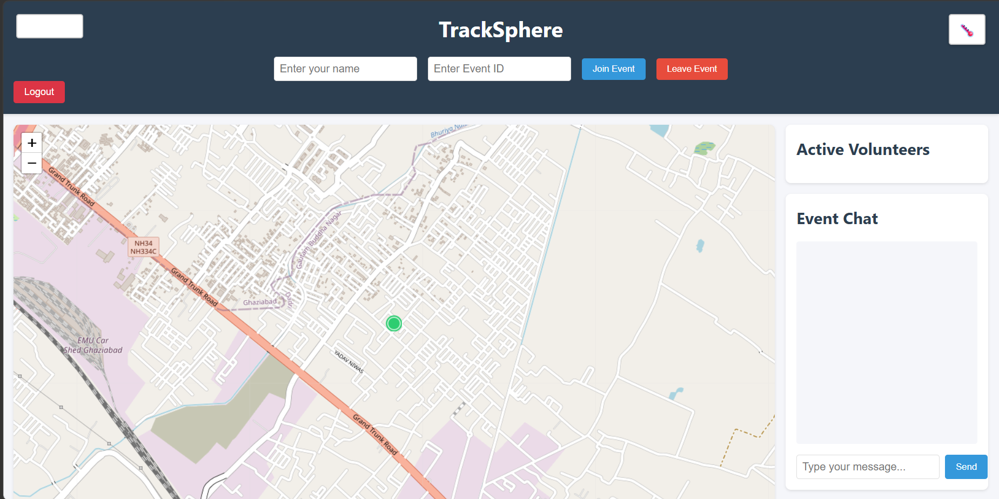
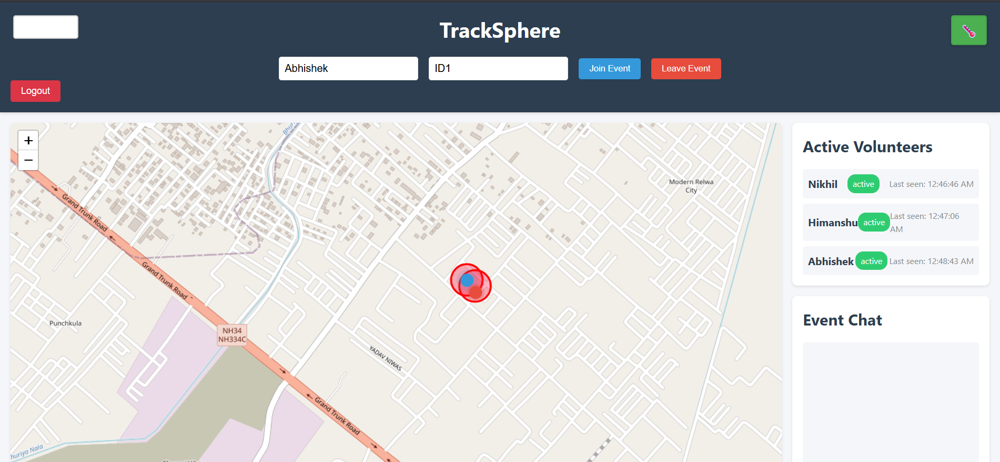
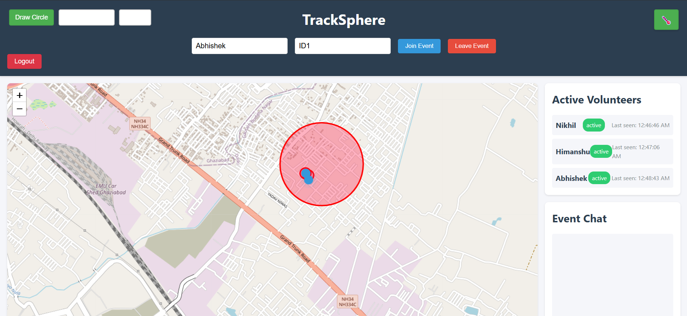
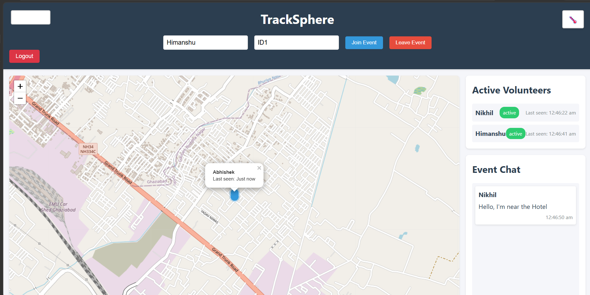

# 🌍 TrackSphere - Real-Time Volunteer Tracking & Coordination Platform

TrackSphere is a real-time volunteer tracking and coordination platform designed for managing field teams, volunteers, emergency response units, and event staff. The system enables live GPS tracking, geofencing, team communication, and location-based monitoring through an interactive map interface.

---

## 🚀 Features

### 📍 Real-Time Location Tracking
- Live GPS tracking of volunteers on an interactive map
- Automatic location updates using browser geolocation
- Real-time synchronization using Socket.IO
- Volunteer status monitoring and last-seen tracking

### 🗺️ Interactive Map Visualization
- OpenStreetMap integration using Leaflet.js
- Live volunteer markers
- Zoom and navigation controls
- Responsive map interface

### 👥 Event-Based Team Coordination
- Join or create tracking events using Event IDs
- View all active volunteers within an event
- Real-time participant monitoring
- Dynamic volunteer management

### 💬 Real-Time Event Chat
- Event-specific communication channels
- Instant messaging using Socket.IO
- Timestamped message history
- Team collaboration during operations

### 🚧 Geofencing System
- Create circular geofence zones
- Define monitoring boundaries
- Visual zone representation on the map
- Real-time geofence event tracking

### 📏 Distance Monitoring
- Measure distance between volunteers
- Monitor team proximity
- Improve field coordination

### 🔐 Secure Authentication
- User registration and login
- JWT-based authentication
- Secure password hashing using bcrypt
- Protected routes and user sessions

---

## 📸 Screenshots

### Dashboard


### Real-Time Volunteer Tracking


### Geofencing System


### Distance Monitoring


---

## 🏗️ System Architecture

```text
Browser (HTML/CSS/JavaScript)
            │
            ▼
      Socket.IO Client
            │
            ▼
    Node.js + Express.js
            │
 ┌──────────┼──────────┐
 │                     │
 ▼                     ▼
MongoDB           Socket.IO
(Database)      Real-Time Layer
```

---

## 🛠️ Tech Stack

### Frontend
- HTML5
- CSS3
- JavaScript
- Leaflet.js
- OpenStreetMap

### Backend
- Node.js
- Express.js
- Socket.IO

### Database
- MongoDB
- Mongoose

### Authentication & Security
- JWT (JSON Web Tokens)
- bcryptjs

### Additional Integrations
- Redis (Configuration Support)
- PostgreSQL/PostGIS (Geospatial Support)
- Kafka (Event Streaming Support)

---

## ⚙️ Installation

### Clone Repository

```bash
git clone https://github.com/your-username/tracksphere.git
cd TrackSphere
```

### Install Dependencies

```bash
npm install
```

### Create Environment Variables

Create a `.env` file:

```env
PORT=3000
MONGODB_URI=mongodb://localhost:27017/tracksphere
JWT_SECRET=your_secret_key
```

### Start MongoDB

Make sure MongoDB is running locally.

### Run Application

```bash
npm start
```

or

```bash
npm run dev
```

### Open Browser

```text
http://localhost:3000
```

---

## 🎯 Use Cases

- Disaster Management
- Emergency Response Coordination
- NGO Volunteer Tracking
- Marathon & Sports Event Management
- Security Team Monitoring
- Field Workforce Tracking
- Community Service Operations

